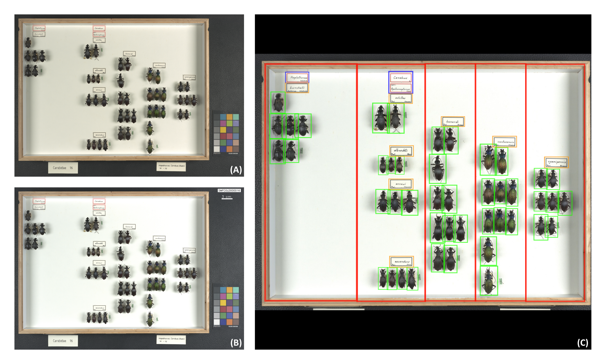

# InsectCount
## Automated Digitization and Specimen Counting from Entomological Collection Drawer Images

This repository contains the code for an automated pipeline for digitising and inventorying entomological museum collections from whole-drawer images. The pipeline combines a YOLOv11 object detection model with optical character recognition (OCR) to detect specimens, genus and species labels within drawer photographs, and outputs structured specimen counts per taxon as a CSV file.

## 📷 Image processing and object detection

