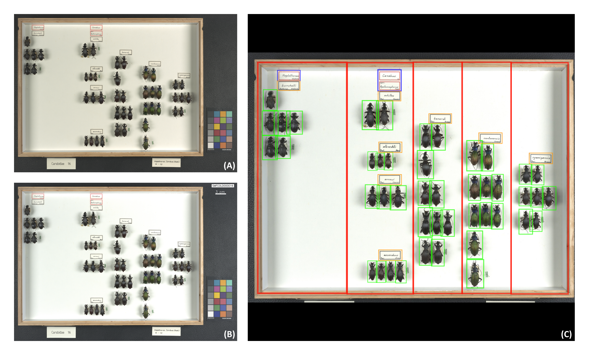

# InsectCount
## Automated Digitization and Specimen Counting from Entomological Collection Drawer Images

This repository contains the code for an automated pipeline for digitising and inventorying entomological museum collections from whole-drawer images. The pipeline combines a YOLOv11 object detection model with optical character recognition (OCR) to detect specimens, genus and species labels within drawer photographs, and outputs structured specimen counts per taxon as a CSV file.

## 📷 Image processing and object detection

## Pipeline Overview

The pipeline consists of the following stages:

1. Image Preprocessing
2. Object Detection (YOLOv11m)

    Identifies: Individual specimens, Drawer columns, Genus-group labels and species-goup labels

3. Optical Character Recognition (OCR)
4. Post-processing & Aggregation
Links specimens to labels and compiles counts per taxon. Exports results as a CSV file for downstream analysis.
